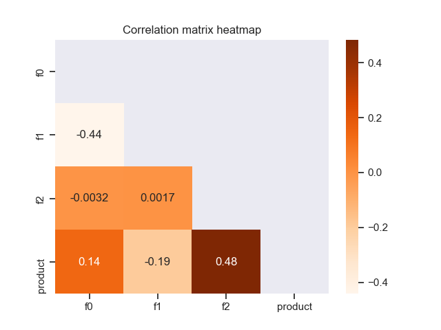

# Rearden

**Rearden** is a Python package that provides a faster way of carrying out data science and running machine learning algorithms in a more convenient way. Making use of the functionality of the most common libraries for data analysis (`pandas`, `numpy`, `statsmodels`), data vizualization (`matplotlib`, `seaborn`) and grid search (`scikit-learn`), it enables reaching the conclusions in a more convenient and faster way.

----

## Modules and API

The package (as of *v0.0.1*) is designed to aid data scientists in quickly getting insights about the data during the following stages of data analysis/machine learning:

* Data preprocessing
* Data vizualization
* Time-series analysis
* Grid search

Hence, the data structures which make up the **Rearden** package have been logically divided into Python modules based off of the above respective parts:

* `preprocessings.py`
* `vizualizations.py`
* `time_series.py`
* `grid_search.py`

### Data preprocessing

Data structures included in `preprocessings.py` are basically programmed to help with missing values, duplicates and data preparation for machine learning algorithms (e.g. data split into sets). For instance, currently the following functions are included in the module:

| Name | Kind | Description |
| :---------------------- | :---------------------- | :---------------------- |
| `identify_missing_values` | *function* | Display of the number and share of missing values |
| `preprocess_duplicates` | *function* | Deletion of duplicated rows with a message |
| `filter_data` | *function* | Filters data according to the predetermined ranges |
| `prepare_sets`| *function* | Data split into sets depending on target name and sets proportions |

The module and the associated functions can be called like so:

```python
from rearden.preprocessings import prepare_sets
```

### Data vizualization

Enhanced data vizualizations tools are located in `vizualizations.py` module. The functions here are as follows:

| Name | Kind | Description |
| :---------------------- | :---------------------- | :---------------------- |
| `plot_model_comparison` | *function* | Vizualization of ML models performances based on their names and scores |
| `plot_corr_heatmap` | *function* | Plotting correlation matrix heatmap in one go|
| `plot_class_structure`| *function* | Plotting the shares of different classes for a target vector in classification problems |

#### Models performance comparison

Using `plot_model_comparison` function, it is very easy to conveniently showcase how models perform according to some metric. One would just run:

```python
import seaborn as sns

from rearden.vizualizations import plot_model_comparison

sns.set_theme()

models_performance = [
    ("Decision Tree", 30.8343),
    ("Random Forest", 29.3127),
    ("Catboost", 26.4651),
    ("Xgboost", 26.7804),
    ("LightGBM", 26.6084),
]

plot_model_comparison(
    results=models_performance,
    metric_name="RMSE",
    title_name="Grid search results",
)
```

The result is the following figure:


#### Correlation matrix heatmap

It is possible to quickly plot the heatmap of the correlation matrix for the data using `plot_corr_heatmap` function. Here is how we would do that:

```python
import pandas as pd
import seaborn as sns

from rearden.vizualizations import plot_corr_heatmap

sns.set_theme()

test_data = pd.read_csv("datasets/test_data.csv")

plot_corr_heatmap(
    data=test_data,
    heatmap_coloring="Oranges",
    annotation=True,
    lower_triangle=True,
)
```

The code above results in the following plot:



### Time-series analysis

Tools for time-series analysis from `time_series.py` are pretty straightforward:

| Name | Kind | Description |
| :---------------------- | :---------------------- | :---------------------- |
| `FeaturesExtractor` | *class* | Extraction of time variables from a one-dimensional time-series depending on lag and rolling mean order values |
| `prepare_ts` | *function* | Data split of a time-series data into sets depending on target name and sets proportions |
| `plot_time_series` | *function* | Plotting the original time-series or a decomposed one |

One can, for example, want to firstly generate the data by `FeaturesExtractor`, then look at the graph via `plot_time_series` and then divide the data into sets with `prepare_ts`. Thus, we would run:

#### Time-series plot and its decomposition

`plot_time_series` function provides two additional ways we could plot a time-series:

* Plain time-series
* Decomposed time-series (trend, seasonality, residual)

Take, for example:

```python
import pandas as pd
import seaborn as sns

from rearden.time_series import plot_time_series

sns.set_theme()

ts_data_test = pd.read_csv("datasets/ts_data_test.csv", parse_dates=[0], index_col=[0])
ts_data_test_resampled = ts_data_test.resample("1H").sum()

plot_time_series(
    data=ts_data_test_resampled,
    col="num_orders",
    period_start="2018-03-01",
    period_end="2018-03-03",
    ylabel_name="Number of orders",
    title_name="Time-series plot",
)
```

In this case we plot the evolution of the number of order against time. We obtain the following plot:


We could also decompose this time series by just adding `kind="decomposed"` to the above function:

```python
plot_time_series(
    data=ts_data_test_resampled,
    col="num_orders",
    kind="decomposed",
    period_start="2018-03-01",
    period_end="2018-03-03",
    ylabel_name="Number of orders",
)
```

The result is as follows:


### Grid search

In `grid_search.py` module, base estimator `RandomizedSearchCV` class from `sklearn.model_selection` was taken, around which two additional classes were wrapped with some additional methods, custom defaults and other functionality:

| Name | Kind | Description |
| :---------------------- | :---------------------- | :---------------------- |
| `RandomizedHyperoptRegression` | *class* | Wrapper for `RandomizedSearchCV` with possibilities to quickly compute regression metrics and conveniently display tuning process |
| `RandomizedHyperoptClassification` | *class* | Wrapper for `RandomizedSearchCV` with possibilities to quickly compute classification metrics, conveniently display tuning process and fastly plot confusion matrix |

#### Confusion matrix

We can use a wrapper `RandomizedHyperoptClassification` for quickly making conclusions about the results of the grid search. For instance, we have managed to split the data into `features_train` and `features_test` as well as `target_train` and `target_test`. We can now run the grid search algorithms and immediately get the plot of the confusion matrix:

```python
from sklearn.tree import DecisionTreeClassifier

from rearden.grid_search import RandomizedHyperoptClassification

dtc_model = DecisionTreeClassifier(random_state=12345)
param_grid_dtc = {"max_depth": np.arange(1, 12)}

dtc_grid_search = RandomizedHyperoptClassification(
    estimator=dtc_model,
    param_distributions=param_grid_dtc,
    train_dataset=(features_train, target_train),
    eval_dataset=(features_test, target_test),
    random_state=12345,
    cv=5,
    n_iter=5,
    scoring="f1",
    n_jobs=None,
)
dtc_grid_search.train_crossvalidate()

dtc_grid_search.plot_confusion_matrix(label_names=("label_1", "label_2"))
```

Thanks to the additional `eval_dataset` attribute, the resulting plot is already a confusion matrix for the best model after cross-validation:


## Installation

### Package dependencies

**Rearden** library requires the following dependencies:

| Package | Version |
| :---------------------- | :---------------------- |
| Matplotlib | >= 3.3.4|
| Pandas | >= 1.2.4|
| NumPy| >= 1.24.3|
| Scikit-learn| >= 1.1.3|
| Seaborn| >= 0.11.1|
| Statsmodels| >= 0.13.2|

> **_NOTE:_**  The package currently requires Python 3.7 or higher.

### Installation using `pip`

The package is available on [PyPI Index](https://pypi.org/project/rearden/) and can be easily installed using `pip`:

```
pip install rearden
```

The dependencies are automatically downloaded when executing the above command or can be installed manually using:

```
pip install -r requirements.txt
```

## Building the package

Thank to the build system requirements and other metadata specified in `pyproject.toml` it is easy to build and install the package. Firstly, clone the repository:

```
git clone https://github.com/spolivin/rearden.git

cd rearden
```

Then, one can simply run the following:

```
pip install -e .
```

## Automatic code style checks

### Installation of `pre-commit`
Before pushing the changed code to the remote Github repository, the code undergoes numerous checks conducted with the help of *pre-commit hooks* specified in `.pre-commit-config.yaml`. Before making use of this feature, it is important to first download `pre-commit` package to the system:

```
pip install pre-commit
```

or if `rearden` package has already been installed:

```
pip install rearden[precommit]
```

Afterwards, in the git-repository run the following command for installation:

```
pre-commit install
```

Now, the *pre-commit hooks* can be easily used for verifying the code style.

### Pre-commit hooks

After running `git commit -m "<Commit message>"` in the terminal, the file to be committed goes through a few checks before being enabled to be committed. As specified in `.pre-commit-config.yaml`, the following hooks are used:

| Hooks | Version |
| :---------------------- | :---------------------- |
| Pre-commit-hooks | 4.3.0 |
| Autoflake | 2.1.1 |
| Isort | 5.12.0 |
| Black | 23.3.0 |
| Flake8 | 5.0.0|

> **_NOTE:_** Check `.pre-commit-config.yaml` for more information about the repos and hooks used.

It is also possible to download the required dependencies for pre-commit hooks:

```
pip install -r requirements-dev.txt
```

or:

```
pip install rearden[formatters]

pip install rearden[linters]
```
