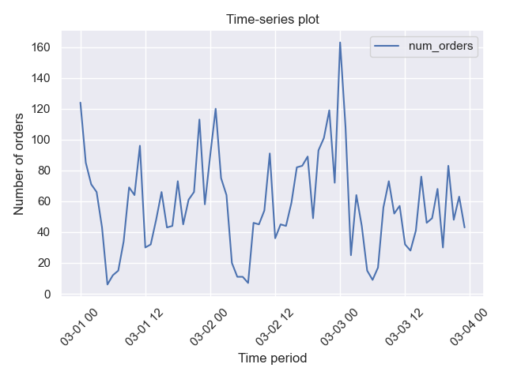

# Rearden

**Rearden** is a Python package that provides a faster and more convenient way of carrying out data science and getting insights from machine learning algorithms. Making use of the functionality of the most popular libraries for data analysis (`pandas`, `numpy`, `statsmodels`), data visualization (`matplotlib`, `seaborn`) and grid search (`scikit-learn`), it enables reaching the conclusions about the data in a quicker and clearer manner.

----

## Modules and API

The package is designed to aid data scientists in quickly getting insights about the data during the following stages of data analysis/machine learning:

* Data preprocessing
* Data visualization
* Time-series analysis
* Grid search

Hence, the data structures which make up the **Rearden** package have been logically divided into the following Python modules (module `decorators.py` serves as an auxiliary file supplying the decorators for some data structures includes in the other modules):

* `preprocessings.py`
* `vizualizations.py`
* `time_series.py`
* `grid_search.py`
* `metrics.py`

### Data preprocessing

Functions included in `preprocessings.py` are basically programmed to help with missing values and data preparation for machine learning algorithms (*e.g.* data split into sets). For instance, currently the following functions and classes are included in the module:

| Name | Kind | Description |
| :---------------------- | :---------------------- | :---------------------- |
| `DataSplitter`| *class* | Data split into sets depending on target name and sets proportions |
| `identify_missing_values` | *function* | Display of the number and share of missing values |

The module and the associated functions can be called like so:

```python
from rearden.preprocessings import DataSplitter
```

#### Splitting data

For instance, if we have a pandas DataFrame which includes both features and target, we can easily separate them into distinct entities and at the same time split them into training/test sets:

```python
from rearden.preprocessings import DataSplitter

splitter = DataSplitter(set_shares=(0.75, 0.25), random_seed=1)

(
features_train,
target_train,
features_test,
target_test
) = splitter.split_data(data=some_dataframe, target="target_name")
```

Likewise, if we need to split the DataFrame into training/validation/test sets:

```python
splitter = DataSplitter(set_shares=(0.6, 0.2, 0.2), random_seed=1)

(
features_train,
target_train,
features_valid,
target_valid,
features_test,
target_test
) = splitter.split_data(data=some_dataframe, target="target_name")
```

Afterwards, it is possible to check the splits via a special `subset_info_` attribute:

```python
splitter.subset_info_
```

We will get the following table:

|  | obs_num | set_shares |
| :---------------------- | ----------------------: | ----------------------: |
| **train** | 5,454 | 0.6 |
| **valid** | 1,818 | 0.2 |
| **test** | 1,819 | 0.2 |

In case we have intended to split the data only into training and test sets, the DataFrame contained in `subset_info_` attribute becomes as follows:

|  | obs_num | set_shares |
| :---------------------- | ----------------------: | ----------------------: |
| **train** | 6,818 | 0.75 |
| **test** | 2,273 | 0.25 |

All data subsets obtained as a result of a DataFrame split are contained in the according attributes of the class and can be used at any time:

```python
features_train = splitter.features_train_
features_valid = splitter.features_valid_
features_test = splitter.features_test_

target_train = splitter.target_train_
target_valid = splitter.target_valid_
target_test = splitter.target_test_
```

Thanks to decorators provided in `decorators.py`, the potential errors which can be made during the instantiation of the class object or during the data split can be caught faster. For instance, `check_proportions` decorator from `DataSplitterDecorators` class will check the correctness of set shares specification in `set_shares` attribute when defining an object. Decorator `check_dimensions` will make sure that we specify two or three values in `set_shares` attribute. Lastly, `check_split` will catch the user's mistake of accessing `subset_info_` attribute before data split has occurred.

#### Missing values calculation

Using a useful `identify_missing_values` function, it is possible to quickly calculate the number and share of missing values in a DataFrame. Furthermore, it also outputs the data type of a column where missing values have been found. For instance:

```python
identify_missing_values(data=some_dataframe)
```

The resulting DataFrame looks as follows:

|  | dtype | missing_count | missing_fraction |
| :---------------------- | ----------------------: | ----------------------: | ----------------------: |
| **col1** | float64 | 400 | 0.8444 |
| **col3** | object | 19 | 0.4512 |
| **col19** | object | 4 | 0.0313 |

In the case that no missing values have been detected, the function will not return anything.

### Data visualization

Enhanced data vizualizations tools are located in `vizualizations.py` module. The functions here are as follows:

| Name | Kind | Description |
| :---------------------- | :---------------------- | :---------------------- |
| `plot_model_comparison` | *function* | Visualization of ML models performances based on their names and scores |
| `plot_corr_heatmap` | *function* | Plotting correlation matrix heatmap in one go|
| `plot_class_structure`| *function* | Plotting the shares of different classes for a target vector in classification problems |

#### Models performance comparison

Using `plot_model_comparison` function, it is very easy to conveniently showcase how models perform according to some metric. One would just run:

```python
import seaborn as sns

from rearden.vizualizations import plot_model_comparison

sns.set_theme()

models_performance = [
    ("Decision Tree", 30.8343),
    ("Random Forest", 29.3127),
    ("Catboost", 26.4651),
    ("Xgboost", 26.7804),
    ("LightGBM", 26.6084),
]

plot_model_comparison(
    results=models_performance,
    metric_name="RMSE",
    title_name="Grid search results",
    save_fig=True,
)
```

The result is the following figure which is automatically saved in the newly created `images` directory upon specifying `save_fig=True` (setting this parameter to `True` automatically activates `rearden.vizualizations.save_plot_in_dir` function that creates `images/` directory and saves the image there):


#### Correlation matrix heatmap

It is possible to quickly plot the heatmap of the correlation matrix for the data using `plot_corr_heatmap` function. Here is how we would do that:

```python
import pandas as pd
import seaborn as sns

from rearden.vizualizations import plot_corr_heatmap

sns.set_theme()

test_data = pd.read_csv("datasets/test_data.csv")

plot_corr_heatmap(
    data=test_data,
    heatmap_coloring="Blues",
    annotation=True,
    lower_triangle=True,
    save_fig=True,
)
```

The code above results in the following plot:


#### Plotting the class structure

The function `plot_class_structure` enables quickly making inquiries into the balancedness/unbalancedness of the target variable:

```python
from rearden.vizualizations import plot_class_structure

plot_class_structure(
    target_var=target_train,
    xlabel_name="Classes",
    ylabel_name="Share",
    title_name="Target variable structure",
    save_fig=True,
)
```

The resulting plot looks, for instance, as follows:


### Time-series analysis

Tools for time-series analysis from `time_series.py` are pretty straightforward:

| Name | Kind | Description |
| :---------------------- | :---------------------- | :---------------------- |
| `TimeSeriesFeaturesExtractor` | *class* | Extraction of time variables from a one-dimensional time-series depending on lag and rolling mean order values |
| `TimeSeriesSplitter` | *class* | Time-series data split into sets with the same functionality as `DataSplitter` |
| `TimeSeriesPlotter` | *class* | Plotting the original time-series or a decomposed one |


One can, for example, want to firstly look at the graph via `TimeSeriesPlotter`, recover time variables from time-series by `TimeSeriesFeaturesExtractor` and then divide the data into sets with `TimeSeriesSplitter`.

#### Time-series plot and its decomposition

`TimeSeriesPlotter` class provides two additional ways we could plot a time-series:

* Plain time-series (`plot_time_series` method)
* Decomposed time-series: trend, seasonality, residual (`plot_decomposed` method)

For example, we can plot the resampled time-series data (with 1 hour periodicity by default):

```python
import pandas as pd
import seaborn as sns

from rearden.time_series import TimeSeriesPlotter

sns.set_theme()

ts_data_test = pd.read_csv("datasets/ts_data_test.csv", parse_dates=[0], index_col=[0])

ts_plotter = TimeSeriesPlotter()

plotter.plot_time_series(
    data=taxi_data,
    resample=True,
    period=("2018-03-01", "2018-03-03"),
    ylabel_name="Number of orders",
    title_name="Time-series plot",
    save_fig=True,
)
```

In this case we plot the evolution of the number of orders against time. We obtain the following plot:



If we want to plot the time-series for the same period of time without resampling, then we just set `resample=False`:

```python
plotter.plot_time_series(
    data=taxi_data,
    resample=False,
    period=("2018-03-01", "2018-03-03"),
    ylabel_name="Number of orders",
    title_name="Time-series plot",
    save_fig=True,
)
```


We could also decompose this time series which in this case should be resampled in any case (applied by default):

```python
plotter.plot_decomposed(
    data=taxi_data,
    period=("2018-03-01", "2018-03-03"),
    ylabel_name="Number of orders",
    save_fig=True,
)
```

The result is as follows:


### Grid search

In `grid_search.py` module, `RandomizedSearchCV` base class from `sklearn.model_selection` was used, which has been wrapped with two additional classes with some additional methods, custom defaults and other functionality:

| Name | Kind | Description |
| :---------------------- | :---------------------- | :---------------------- |
| `RandomizedHyperoptRegression` | *class* | Wrapper for `RandomizedSearchCV` with functionality to quickly compute regression metrics and conveniently display tuning process |
| `RandomizedHyperoptClassification` | *class* | Wrapper for `RandomizedSearchCV` with functionality to quickly compute classification metrics, conveniently display tuning process and fastly plot confusion matrix |
| `SimpleHyperparamsOptimizer` | *class* | Custom class that implements a simple grid search algorithm without cross-validation. |

The module also includes one custom `SimpleHyperparamsOptimier` class written from scratch that enables quickly running a grid search when, for instance, we need to optimize the hyperparameters of the model on one distinct validation set.

#### Hyperparameter tuning

We can use `RandomizedHyperoptClassification` or `RandomizedHyperoptRegression` wrappers for quickly making conclusions about the results of the grid search. For instance, let's imagine that we have managed to split the data into `features_train` and `features_test` as well as `target_train` and `target_test`. We can now run the grid search algorithms and immediately get the plot of the confusion matrix:

```python
from sklearn.tree import DecisionTreeClassifier

from rearden.grid_search import RandomizedHyperoptClassification as RHC

dtc_model = DecisionTreeClassifier(random_state=12345)
param_grid_dtc = {"max_depth": np.arange(2, 12)}

dtc_grid_search = RHC(
    estimator=dtc_model,
    param_distributions=param_grid_dtc,
    train_dataset=(features_train, target_train),
    eval_dataset=(features_test, target_test),
    random_state=12345,
    cv=5,
    n_iter=5,
    scoring="f1",
    n_jobs=None,
    return_train_score=True,
)
dtc_grid_search.train_crossvalidate()
```

After the completing grid search, the method `train_crossvalidate` will notify us of the completion:

```
Grid search for DecisionTreeClassifier completed.
Time elapsed: 0.6 s
```

#### Tuning process display

We can then get a convenient representation of the tuning progress by using `display_tuning_process` method:

```python
dtc_grid_search.display_tuning_process()
```

|  | max_depth | mean_test_score | mean_train_score |
| :---------------------- | ----------------------: | ----------------------: | ----------------------: |
| **0** | 2 | 0.4970 | 0.5065 |
| **1** | 9 | 0.5448 | 0.7347 |
| **2** | 5 | 0.5059 | 0.5379 |
| **3** | 11 | 0.5402 | 0.8257 |
| **4** | 8 | 0.5432 | 0.6869 |

Since this class inherits from `sklearn.model_selection.RandomizedSearchCV`, it also has access to usual `best_estimator_`, `best_score_`, `best_params_` attributes.

#### Metrics computation

Thanks to the additional `eval_dataset` attribute, the resulting plot is already a confusion matrix for the best model after cross-validation which has been used for making predictions on the test data:


It is also possible to compute all classification metrics using `classif_stats_` attribute that just outputs the result of applying `sklearn.metrics.classification_report` to data contained in `eval_dataset` attribute.

Other functionality of the wrappers for classification and regression can be consulted in the `grid_search.py` module.

## Installation

### Package dependencies

**Rearden** library requires the following dependencies:

| Package | Version |
| :---------------------- | :---------------------- |
| Matplotlib | >= 3.3.4|
| Pandas | >= 1.2.4|
| NumPy| >= 1.24.3|
| Scikit-learn| >= 1.1.3|
| Seaborn| >= 0.11.1|
| Statsmodels| >= 0.13.2|

> **_NOTE:_**  The package currently requires Python 3.9 or higher.

### Installation using `pip`

The package is available on [PyPI Index](https://pypi.org/project/rearden/) and can be easily installed using `pip`:

```
pip install rearden
```

The dependencies are automatically downloaded when executing the above command or can be installed manually using (after cloning the repo):

```
pip install -r requirements.txt
```

## Building the package

Thanks to the build system requirements and other metadata specified in `pyproject.toml` it is easy to build and install the package. Firstly, clone the repository:

```
git clone https://github.com/spolivin/rearden.git

cd rearden
```

Then, one can simply run the following:

```
pip install -e .
```

## Automatic code style checks

### Installation of `pre-commit`
Before pushing the changed code to the remote Github repository, the code undergoes numerous checks conducted with the help of *pre-commit hooks* specified in `.pre-commit-config.yaml`. Before making use of this feature, it is important to first download `pre-commit` package to the system:

```
pip install pre-commit
```

or if `rearden` package has already been installed (`pre-commit` is installed together with the linters):

```
pip install rearden[linters]
```

Afterwards, in the git-repository run the following command for installation:

```
pre-commit install
```

Now, the *pre-commit hooks* can be easily used for verifying the code style.

### Pre-commit hooks

After running `git commit -m "<Commit message>"` in the terminal, the file to be committed goes through a few checks before being enabled to be committed. As specified in `.pre-commit-config.yaml`, the following hooks are used:

| Hooks | Version |
| :---------------------- | :---------------------- |
| Pre-commit-hooks | 4.3.0 |
| Pyupgrade | 3.10.1 |
| Autoflake | 2.1.1 |
| Isort | 5.12.0 |
| Black | 23.3.0 |
| Flake8 | 6.0.0|
| Codespell | 2.2.4|

> **_NOTE:_** Check `.pre-commit-config.yaml` for more information about the repos and hooks used.
